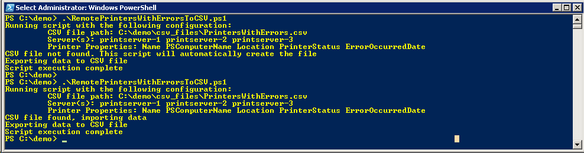
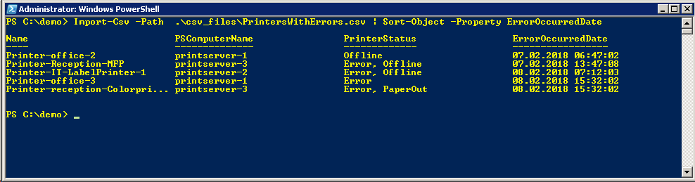

# RemotePrintersWithErrorsToCSV
A PowerShell script is to obtain a list of printers with errors and when the error occurred from one or multiple servers

**Description**  
This script is made to create and mantain a CSV file updated with error information from one or multiple Print Servers.
The main purpose is to have an updated file with infomation about which printers that has gone offline, or have an error and when the error occurred.

This script is intended to run routinely with for example Windows Task Scheduler to make ErrorOccurredDate reliable.

**Requirements**
* Windows PowerShell 3 or Newer.
* Windows Remote Management
  https://msdn.microsoft.com/en-us/library/aa384426(v=vs.85).aspx
* PrintManagement v1.1 PowerShell module or newer on both print server(s) and script execution server
  https://docs.microsoft.com/en-us/powershell/module/printmanagement/?view=win10-ps
  the script execution machine.

**Running as Task in Windows Task Scheduler**
Here is an exable of action:
    
    Program/script: C:\Windows\System32\WindowsPowerShell\v1.0\powershell.exe
    Add arguments (optional): -noprofile -executionpolicy bypass -file "C:\demo\RemotePrintersWithErrorsToCSV.ps1"
    Start in (optional): C:\demo\

**Screenshots**  
Example of running the script  

Example of viewing results using the Import-Csv and Sort-Object cmdlets.

